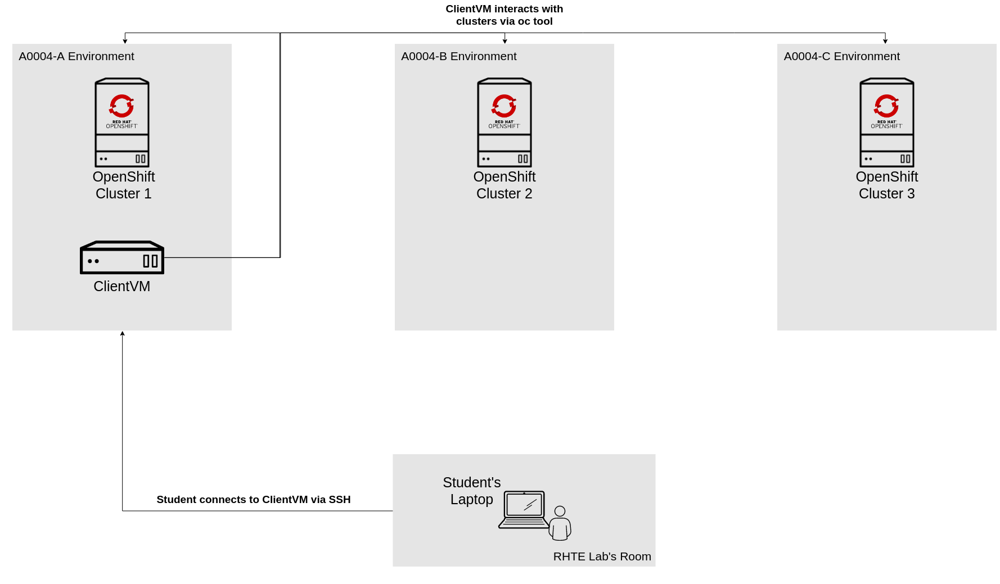

# Accessing to the Lab Environment

## Getting your dedicated lab environments using Guid Grabber

On your laptop, you **MUST** open **THREE** browser tabs to [*Lab GUID Assignment page*](https://www.opentlc.com/gg/gg.cgi?profile=generic_rhte) before continuing with the lab instructions:

* From this page, you will be assigned your unique GUID, which you will use to access your unique lab environment and systems.
* For this lab you will need three different environments, pay attention while selecting the *Lab Code* from the drop down list.

> **NOTE: You are not required to login anywhere at this point, in this intro lab you will only get the information related to your assigned lab environments.**

### Getting Cluster 1 Environment - **Browser Tab 1**

This will be your main environment where most of the work will be done. 

From the drop down list:

1. Choose the lab `A0004-A - Hands on with Red Hat Multi-Cluster Federation: Application Portability`
2. Enter the activation key shared by the instructors
3. Enter your email address
4. Click submit
5. Save the information on screen

e.g:

The resulting *Lab Information page* will display your lab's GUID and other useful information about your lab environment.
Take note of your assigned GUID.

You will use this GUID to access your lab's environment and systems.
Your unique GUID will also be embedded in your lab environment's host names.

### Getting Cluster 2 Environment - **Browser Tab 2**

From the drop down list:

1. Choose the lab `A0004-B - Hands on with Red Hat Multi-Cluster Federation: Application Portability`
2. Enter the activation key shared by the instructors
3. Enter your email address
4. Click submit
5. Save the information on screen

### Getting Cluster 3 Environment - **Browser Tab 3**

From the drop down list:

1. Choose the lab `A0004-C - Hands on with Red Hat Multi-Cluster Federation: Application Portability`
2. Enter the activation key shared by the instructors
3. Enter your email address
4. Click submit
5. Save the information on screen

> NOTE: If any issues occur after hitting submit do not close the tab.

## Lab Environment Overview

> **NOTE:** If you cannot see the diagram properly, you can click on it and it will open full-size.

Next Lab: [Lab 1 - Introduction and Prerequisites](./1.md) 
[Home](./README.md)
